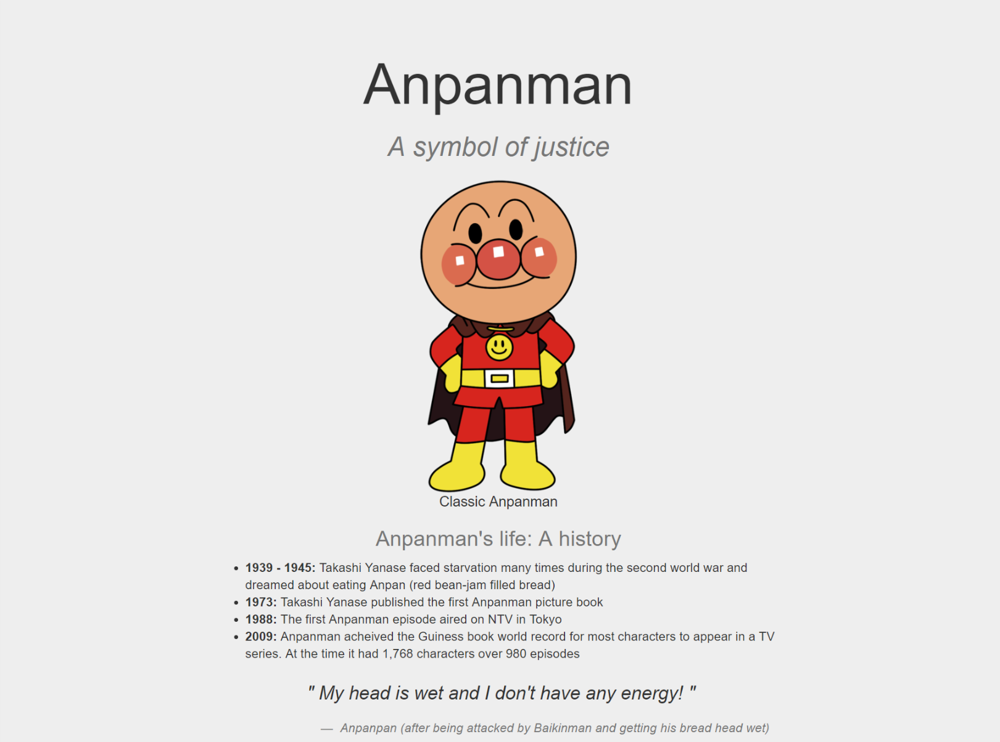
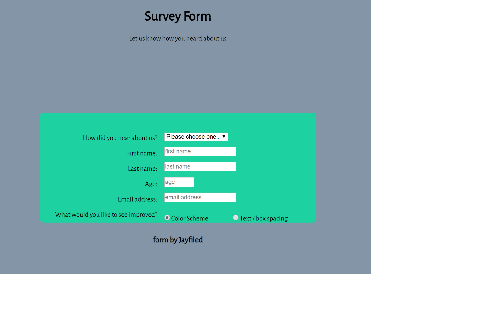

# freeCodeCamp

This repository contains my solved [freeCodeCamp](https://www.freecodecamp.org) projects and challenges that are required for certification.

&nbsp;

## Table of Contents

### freeCodeCamp Certifications

- [x] [**Responsive Web Design**](https://github.com/jayfiled/ZeroToMasteryProjects)
- [ ] [**JavaScript Algorithms and Data Structures**](https://github.com/jayfiled/fcc/tree/master/js_basic_algorithms)
- [ ] [Front End Libraries]
- [ ] [Data Visualization]
- [ ] API and Microservices
- [ ] Information Security and Quality Assurance

&nbsp;

## Responsive Web Design

- [**Build a Tribute Page**](https://codepen.io/jayfiled/full/ZowvbG)

  

  _#html, #css, #sass, #bootstrap_

- [**Build a Survey Form**](#)

  

  _#html, #css, #css grid, #css flexbox, #javascript_

- [**Build A Product Landing Page**](https://jayfiled.github.io/product-landing-page/)

  

  _#html, #css, #css grid, #css flexbox_

- [**Build a Technical Documentation Page**](#)

  

  _#html_

- [**Build a Personal Portfolio Webpage**](https://jayfiled.github.io/portfolio/)

  

  _#html, #css, #sass, #javascript, #jquery, #bootstrap_

&nbsp;

## JavaScript Algorithms and Data Structures

### Basic Algorithm Scripting

- [ x ] [**Convert Celsius to Fahrenheit**](https://github.com/jayfiled/fcc/blob/master/js_basic_algorithms/convert_celsius_to_fahrenheit.js)
- [ x ] [**Reverse a String**](https://github.com/jayfiled/fcc/blob/master/js_basic_algorithms/reverse_a_string.js)
- [ x ] [**Factorialize a Number**](https://github.com/jayfiled/fcc/blob/master/js_basic_algorithms/factorialize_a_number.js)
- [ x ] [**Find the Longest Word in a String**](https://github.com/jayfiled/fcc/blob/master/js_basic_algorithms/find_the_longest_word_in_a_string.js)
- [ x ] [**Return Largest Numbers in Arrays**](https://github.com/jayfiled/fcc/blob/master/js_basic_algorithms/return_largest_number_in_arrays.js)
- [ x ] [**Confirm the Ending**](https://github.com/jayfiled/fcc/blob/master/js_basic_algorithms/confirm_the_ending.js)
- [ x ] [**Repeat a String Repeat a String**](https://github.com/jayfiled/fcc/blob/master/js_basic_algorithms/repeat_a_string_repeat_a_string.js)
- [ x ] [**Truncate a String**](https://github.com/jayfiled/fcc/blob/master/js_basic_algorithms/truncate_a_string.js)
- [ x ] [**Finders Keepers**](https://github.com/jayfiled/fcc/blob/master/js_basic_algorithms/finders_keepers.js)
- [ x ] [**Boo who**](https://github.com/jayfiled/fcc/blob/master/js_basic_algorithms/boo_who.js)
- [ x ] [**Title Case a Sentence**](https://github.com/jayfiled/fcc/blob/master/js_basic_algorithms/title_case_a_sentence.js)
- [ x ] [**Slice and Splice**](https://github.com/jayfiled/fcc/blob/master/js_basic_algorithms/slice_and_splice.js)
- [ x ] [**Falsy Bouncer**](https://github.com/jayfiled/fcc/blob/master/js_basic_algorithms/falsy_bouncer.js)
- [ x ] [**Where do I Belong**](https://github.com/jayfiled/fcc/blob/master/js_basic_algorithms/where_do_i_belong.js) ~ working on ~
- [  ] [**Mutations**]()
- [  ] [**Chunky Monkey**](#)

### Intermediate Algorithm Scripting

### Advanced Algorithm Scripting

&nbsp;

## Front End Libraries

- [**Project Placeholder**](#)

  

  _#html, #css, #sass, #javascript, #jquery, #foundation, #motion-ui_